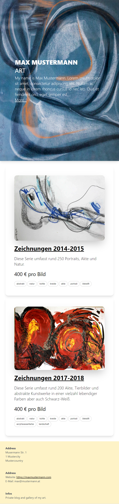
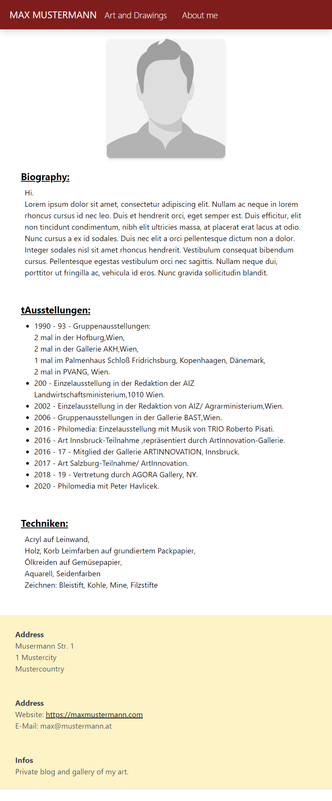
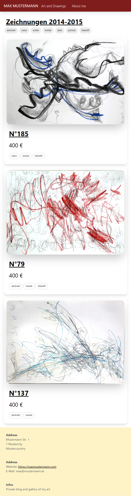
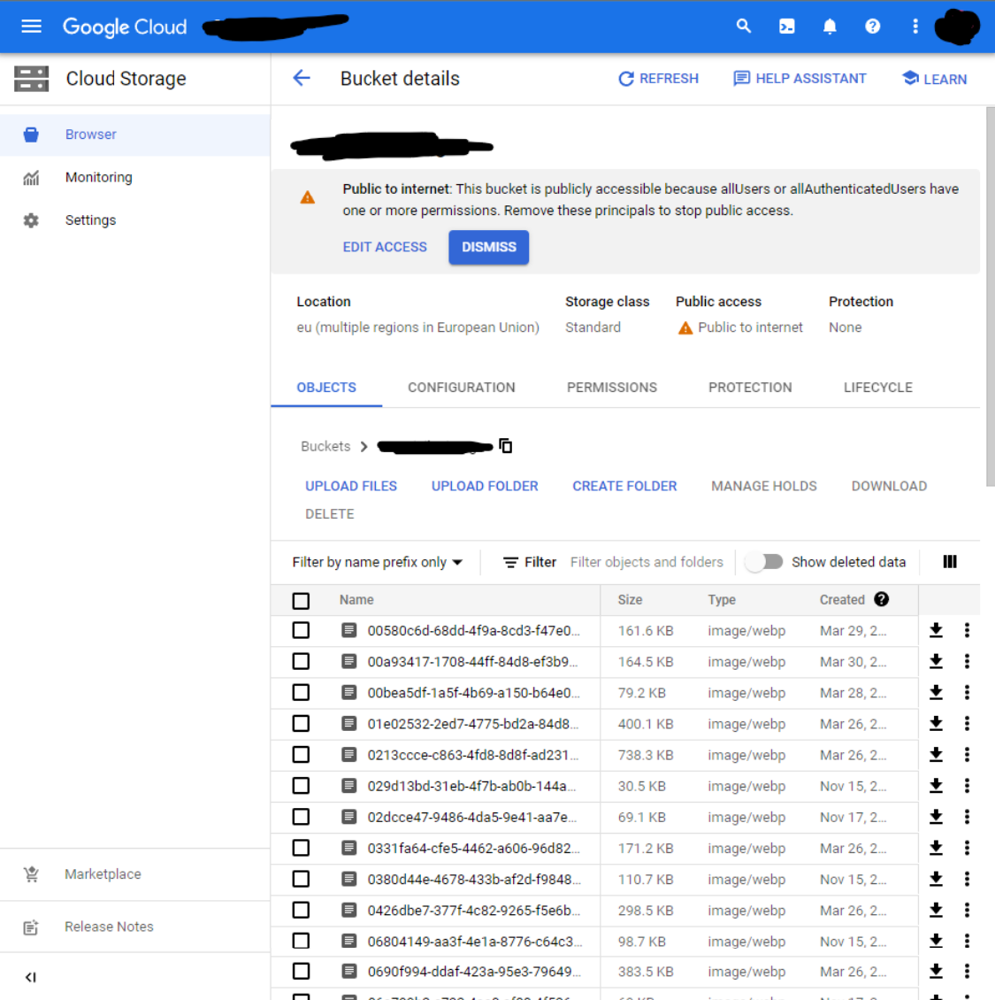
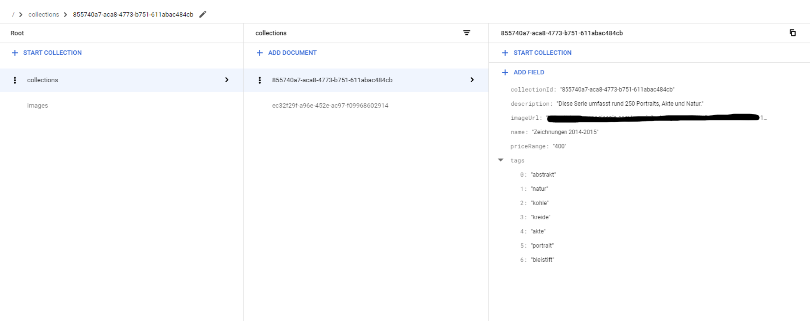
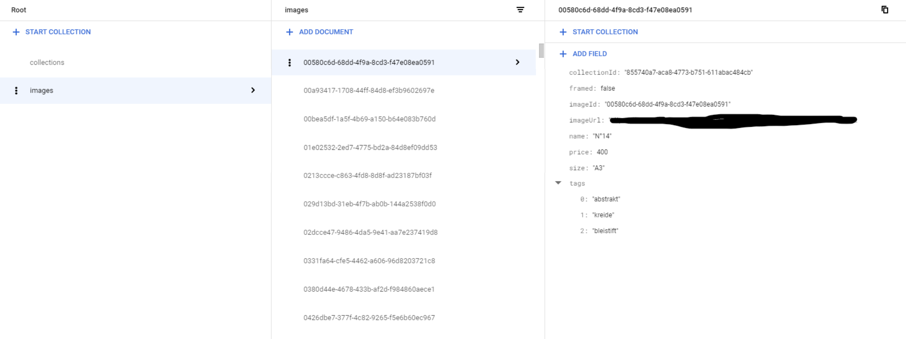

# Artist Portfolio

This site helps artists to make their work availiable as a website.

## Images

## Usage

Upload your images to a GCP Bucket and give each a one different unique name.

Then create two collections in your firebase database.

### Collections

### Images

Download a GCP Firebase service key which allows access to the firebase database containing your artworks and name it `key.json`.